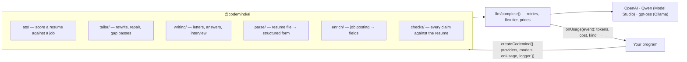

# @codemind/ai

The AI code behind [CodeMind Jobs](https://jobs.codemind.site), a job search site that scores
resumes against job postings, tailors them, and drafts cover letters and application answers. This
repository is that code on its own: model calls, ATS scoring, resume tailoring, letters, interview
prep, resume parsing and rendering, and job posting enrichment.

It never touches a database, the environment, users or billing. The program around it hands in
what it needs once, and every answer a model gives is checked in code before anything uses it.



## What is in it

| Folder | What it does |
| --- | --- |
| `llm/` | `complete()`, the one door to the model: providers chosen by model name, retries, OpenAI's flex tier, the Batch API, prices, metering |
| `ats/` | a posting's requirements read once, then a resume judged against each one. The model gives a verdict per requirement with a quote; the score is worked out in code |
| `tailor/` | the rewrite for one job in three modes (score first, balanced, looks real), a repair round, gap passes for what is still missing, and the whole pipeline (`runTailoring`) |
| `writing/` | cover letters (with each market's letter conventions), application answers, referral requests, interview prep and feedback on a practice answer |
| `parse/` | an uploaded resume read into a structured form |
| `enrich/` | a job posting read into fields (category, work type, location, salary, skills…), validated against the posting's own text, retried with the failed checks |
| `checks/` | figures, tenures and certifications a model wrote, checked against what the resume actually says |
| `text/` | keywords, a skills dictionary, countries and a city gazetteer, seniority, salaries, prompt fences, voice rules |
| `resume/` | the structured resume form, text extraction from PDF and DOCX, `.docx` and PDF rendering in three ATS-safe templates |
| `testing/` | a scripted fake model, and snapshots of every prompt the features send |

## Quick start

Node 22 or later.

```bash
npm install
npm test                                        # 300+ tests, no API key needed
node examples/offline.js                        # scoring against a scripted model, no key
OPENAI_API_KEY=sk-... node examples/score.js    # one real scoring call (a fraction of a cent)
```

```js
import { createCodemind } from '@codemind/ai';

const ai = createCodemind({
  providers: { openai: { apiKey: process.env.OPENAI_API_KEY } },
  models: () => ({
    defaultModel: 'gpt-4o-mini',
    ats: { model: 'gpt-4.1-mini', fallbackModel: 'gpt-5-mini', effort: 'minimal', fallbackEffort: 'minimal' },
    enrich: { model: 'gpt-5-nano', effort: 'low', fallbackModel: 'gpt-5-mini', fallbackEffort: 'low' },
    parse: { model: 'gpt-5-mini', effort: 'minimal', fallbackModel: 'gpt-5-mini', fallbackEffort: 'low' },
  }),
  onUsage: (event) => console.log(event.kind, event.model, `$${event.costUsd.toFixed(5)}`),
});

const score = await ai.quickScoreResume(resumeForm, job);
console.log(score.score, score.requirements);
```

- **Setup:** one setup per process. `models` is read on every call, so a change applies at once.
  Until `createCodemind()` runs, a model call throws instead of going out unmetered.
- **Errors:** errors are `AiError`s with a `status`, a stable `code` (`ai_no_credits`,
  `upstream_failed`, …) and a message safe to show a user.
- **Types:** the public functions carry JSDoc types, and `src/types.js` holds the shapes
  (`ResumeForm`, `Job`, `Scoring`, `UsageEvent`, …). An editor shows them without a build step.
- **Imports:** the root export is everything that may call a model. `@codemind/ai/text/*` and
  `@codemind/ai/resume/*` are pure and can be imported by path.

## How it is tested

`src/testing/prompts.test.js` runs every feature through the real `complete()` against a scripted
model. It pins each request in `src/testing/snapshots/*.txt`: the messages, model, settings,
response schema and how the call is metered. A refactor that changes any prompt shows up as a
snapshot diff. After a deliberate prompt change, run `UPDATE_SNAPSHOTS=1 npm test` and review the
diff.

## Status

This code runs in production at CodeMind Jobs, where it was extracted from a larger private app.
Comments still refer to that app now and then. It is shared to read and learn from.

There is no license, so all rights are reserved: you may read the code and fork it on GitHub, but
not reuse it elsewhere. Parts are derived from open-source projects under their own licenses; see
[THIRD_PARTY_NOTICES.md](THIRD_PARTY_NOTICES.md).
